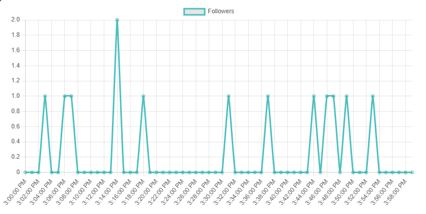

# How to Display BlueSky Followers Graph in Svelte for any account


This guide walks you through every step: acquiring your API key, fetching follower data, installing Chart.js, and rendering a live chart in a Svelte component.

## Prerequisites

- Node.js v22+ and npm installed

## 1. Acquire Your Graphtracks API Key

## 2. Initialize a New Svelte Project

Use the modern Svelte CLI to scaffold your project in one command:

```bash
npx sv create
```

## 2. Install API Client and Chart Library

Run:

```bash
npm install @graphtracks/client chart.js
```

- **@graphtracks/client**: to call BlueSky Analytics API
- **chart.js**: to render the data

## 3. Configure Your API Key

Inside `src/lib/`, `index.ts`:

```ts
export const GRAPHTRACKS_API_KEY = "YOUR_API_KEY_HERE";
```

> **Tip:** For production, load this from an environment variable instead of hard-coding.

## 4. Build the BlueSkyGraph Component

Create `src/lib/BlueSkyGraph.svelte` with the following content:

```html
<script lang="ts">
    import { BlueSkyAnalyticsApi, type DataPoint } from "@graphtracks/client";
    import { Configuration } from "@graphtracks/client";
    import { Metric, Network, Timeframe } from "@graphtracks/client";
    import { onMount } from "svelte";
    import Chart from "chart.js/auto";
    import { GRAPHTRACKS_API_KEY } from "$lib";

    const api = new BlueSkyAnalyticsApi(
        new Configuration({
            apiKey: GRAPHTRACKS_API_KEY,
        }),
    );

    let data;
    let chartCanvas: HTMLCanvasElement;
    let chart: Chart | undefined;
    let username = "";

    async function usernameToDid(username: string): Promise<string> {
        const res = await fetch(
            `https://bsky.social/xrpc/com.atproto.identity.resolveHandle?handle=${username}`,
        );
        const data = await res.json();
        return data.did;
    }

    async function fetchData() {
        if (!username) return;
        const accountId = await usernameToDid(username);

        data = await api.getGlobalStatsForAccountAPI({
            network: Network.BlueSky,
            accountId,
            metric: Metric.Followers,
            timeframe: Timeframe._1h,
            bucket: "60",
        });

        if (data && chartCanvas) {
            const ctx = chartCanvas.getContext("2d");
            if (!ctx) return;

            if (chart) {
                chart.destroy();
            }
            chart = new Chart(ctx, {
                type: "line",
                data: {
                    labels: data.data.map((item: DataPoint) =>
                        new Date(item.time).toLocaleTimeString(),
                    ),
                    datasets: [
                        {
                            label: "Followers",
                            data: data.data.map(
                                (item: DataPoint) => item.value,
                            ),
                            borderColor: "rgb(75, 192, 192)",
                            tension: 0.1,
                        },
                    ],
                },
                options: {
                    responsive: true,
                    scales: {
                        y: {
                            beginAtZero: true,
                        },
                    },
                },
            });
        }
    }

    onMount(() => {
        fetchData();
    });
</script>

<div style="width: 800px; height: 50px;">
    <input bind:value={username} placeholder="Username" />
    <button on:click={fetchData}>Fetch</button>
</div>
<div style="width: 800px; height: 400px;">
    <canvas bind:this={chartCanvas}></canvas>
</div>
```

> **Timeframe:** Timeframe specifies the total duration of historical data you want. For example: 1h fetches data from the last 1 hour


> **Bucket:** Bucket defines the aggregation interval (in seconds) for your data points. For example: A bucket of 60 returns one data point per minute

> **Best Practices:** Aim for 50–150 points on the chart to keep it readable. (Depends on graph width)


## 5. Integrate into Your App

In `src/App.svelte`:

```html
<script lang="ts">
  import BlueSkyGraph from "./lib/BlueSkyGraph.svelte";
</script>

<main>
  <h1>BlueSky Followers Over Time</h1>
  <BlueSkyGraph />
</main>
```
## 6. Result





