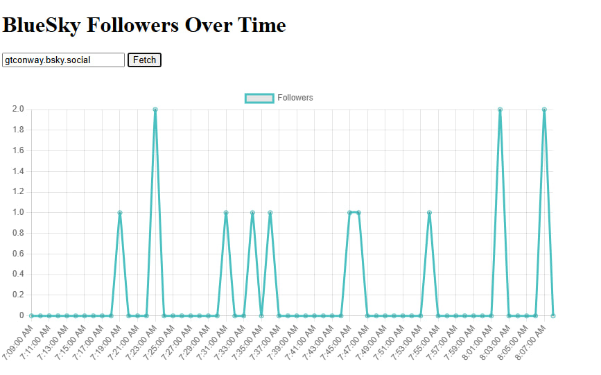

This guide walks you through every step: acquiring your API key, fetching follower data, installing Chart.js, and rendering a live chart in a Svelte component.

## Prerequisites

* Node.js v22+ and npm installed

## 1. Acquire Your Graphtracks API Key

## 2. Initialize a New Svelte Project

Use the modern Svelte CLI to scaffold your project in one command:

```bash
npx sv create
```

## 3. Install API Client and Chart Library

Run:

```bash
npm install @graphtracks/client chart.js
```

* **@graphtracks/client**: to call BlueSky Analytics API
* **chart.js**: to render the data

## 4. Configure Your API Key

Inside `.env`:

```ts
PUBLIC_API_KEY="YOUR_API_KEY_HERE"
```

## 5. Resolve Username to DID

Create a helper function in `src/lib/BlueSkyGraph.svelte`:

```ts
async function usernameToDid(username: string): Promise<string> {
    const res = await fetch(
        `https://bsky.social/xrpc/com.atproto.identity.resolveHandle?handle=${username}`
    );
    const data = await res.json();
    return data.did;
}
```

This converts a BlueSky handle into the unique DID required by the analytics API.

## 6. Fetch Follower Data

Add a `fetchData` function in the same file:

```ts
async function fetchData() {
    if (!username) return;
    const accountId = await usernameToDid(username);

    data = await api.getGlobalStatsForAccountAPI({
        network: Network.BlueSky,
        accountId,
        metric: Metric.Followers,
        timeframe: Timeframe._1h,
        bucket: "60",
    });
}
```

This retrieves follower counts in one-minute intervals over the last hour.

## 7. Render the Chart

After fetching, initialize or update the Chart.js instance:

```ts
if (data && chartCanvas) {
    const ctx = chartCanvas.getContext("2d");
    if (!ctx) return;
    if (chart) chart.destroy();
    chart = new Chart(ctx, {
        type: "line",
        data: {
            labels: data.data.map(item => new Date(item.time).toLocaleTimeString()),
            datasets: [{
                label: "Followers",
                data: data.data.map(item => item.value),
                borderColor: "rgb(75, 192, 192)",
                tension: 0.1
            }]
        },
        options: {
            responsive: true,
            scales: { y: { beginAtZero: true } }
        }
    });
}
```


## 8. Integrate into Your App

In `src/App.svelte`:

```html
<script lang="ts">
  import BlueSkyGraph from "./lib/BlueSkyGraph.svelte";
</script>

<main>
  <h1>BlueSky Followers Over Time</h1>
  <BlueSkyGraph />
</main>
```


## 9. Full Code

```html
<script lang="ts">
    import { BlueSkyAnalyticsApi, type DataPoint } from "@graphtracks/client";
    import { Configuration } from "@graphtracks/client";
    import { Metric, Network, Timeframe } from "@graphtracks/client";
    import { onMount } from "svelte";
    import Chart from "chart.js/auto";
    import { PUBLIC_API_KEY } from "$env/static/public";

    const api = new BlueSkyAnalyticsApi(
        new Configuration({
            apiKey: PUBLIC_API_KEY,
        }),
    );

    let data: { data: DataPoint[] } | undefined;
    let chartCanvas: HTMLCanvasElement;
    let chart: Chart | undefined;
    let username = "";

    async function usernameToDid(username: string): Promise<string> {
        const res = await fetch(
            `https://bsky.social/xrpc/com.atproto.identity.resolveHandle?handle=${username}`,
        );
        const data = await res.json();
        return data.did;
    }

    async function fetchData() {
        if (!username) return;
        const accountId = await usernameToDid(username);

        data = await api.getGlobalStatsForAccountAPI({
            network: Network.BlueSky,
            accountId,
            metric: Metric.Followers,
            timeframe: Timeframe._1h,
            bucket: "60",
        });

        if (data && chartCanvas) {
            const ctx = chartCanvas.getContext("2d");
            if (!ctx) return;

            if (chart) {
                chart.destroy();
            }
            chart = new Chart(ctx, {
                type: "line",
                data: {
                    labels: data.data.map((item: DataPoint) =>
                        new Date(item.time).toLocaleTimeString(),
                    ),
                    datasets: [
                        {
                            label: "Followers",
                            data: data.data.map(
                                (item: DataPoint) => item.value,
                            ),
                            borderColor: "rgb(75, 192, 192)",
                            tension: 0.1,
                        },
                    ],
                },
                options: {
                    responsive: true,
                    scales: {
                        y: {
                            beginAtZero: true,
                        },
                    },
                },
            });
        }
    }
</script>

<div style="width: 800px; height: 50px;">
    <input bind:value={username} placeholder="Username" />
    <button on:click={fetchData}>Fetch</button>
</div>
<div style="width: 800px; height: 400px;">
    <canvas bind:this={chartCanvas}></canvas>
</div>

```


## 10. Result



---

**Timeframe:** Total duration of historical data (e.g., 1h = last hour)

**Bucket:** Aggregation interval in seconds (e.g., 60 = one point per minute)

**Best Practices:** Keep 50–150 points for readability.
